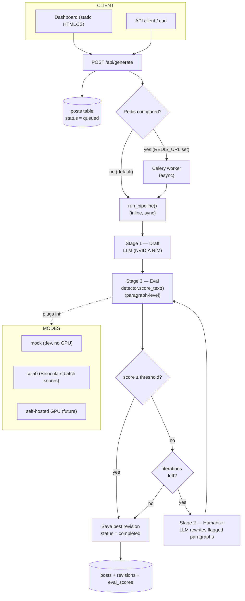

# blog-gen — Architecture & Tech Stack

AI blog generator + humanizer. Ek topic diya jata hai, LLM draft likhta hai,
phir ek humanize pass (varied sentence lengths, natural voice, uncommon word
choices) deta hai, aur ek **detector eval loop** check karta hai ki text kitna
"AI-sounding" hai. Loop tab tak iterate karta hai jab tak score threshold se
niche na aa jaye. Content hamesha original generate hota hai (kabhi copy
nahi), isliye plagiarism checkers naturally pass hote hain.

---

## 1. End-to-end flow



---

## 2. Request lifecycle (step by step)

1. **POST /api/generate** `{topic, max_iterations, threshold, max_tokens}`
2. **create_post()** → `posts` row banta hai `status="queued"`
3. **Dispatch**: agar `REDIS_URL` set hai → Celery `generate_post` task (async, client polling karta hai). Warna → `run_pipeline()` **inline** (same request me).
4. **Stage 1 — Draft**: LLM ko topic dete hain, ek high-quality draft aata hai (temperature ~0.85, `##` headings, no emojis, no AI intro).
5. **Stage 3 — Eval**: detector har paragraph ka AI-score nikalta hai + overall score.
   - Overall ≤ threshold → **pass**, accept kar lo.
   - Overall > threshold → **Stage 2** par jao.
6. **Stage 2 — Humanize**: jo paragraphs flag hue hain unhe LLM rewrite karta hai (burstiness, natural voice, concrete language, facts same rakhe — naye facts invent nahi).
7. **Loop**: re-score → agar abhi bhi high aur iterations bache → phir humanize. Max `MAX_ITERATIONS` (default 3) eval rounds.
8. **Best revision choose**: sabse kam AI-score wali revision final banti hai.
9. **Save**: `posts`, `revisions` (har iteration), `eval_scores` (overall + paragraph-level) DB me.
10. **Response**: `{request_id, status, title, final_score, iterations_used, content}` → dashboard detail view me render.

---

## 3. Pipeline ke 3 stages

| Stage | Kya karta hai | Kyon |
|---|---|---|
| **1. Draft** | LLM se topic par structured blog | Original content by construction — kabhi source text copy nahi hota, isliye plagiarism checkers naturally pass |
| **2. Humanize** | Flagged paragraphs ko LLM se rewrite | AI detectors formulaic patterns pakadte hain; is pass se sentence-length variance (burstiness), uncommon words (perplexity), personal voice aati hai |
| **3. Eval loop** | Detector har paragraph score karta hai, threshold check | Sirf weak sections rewrite hote hain (cost control), best revision choose hota hai, quality measurable rehti hai |

---

## 4. Tech stack — kya kya use hua aur kyun

| Layer | Tech | Kyon |
|---|---|---|
| **API** | FastAPI + Uvicorn | Python, auto OpenAPI docs, sync/async dono easy, light startup |
| **Queue (optional)** | Celery + Redis | Long generation (2-4 min) ko request se alag karke async run karne ke liye. Sirf `REDIS_URL` set hone par active — nahi toh sync fallback |
| **Database** | SQLAlchemy 2.0 ORM | Ek interface, do backends: **SQLite** (local, zero setup) + **PostgreSQL** (docker/Render, multi-process) |
| **DB schema** | `posts`, `revisions`, `eval_scores` | Full history — har iteration ka content + score, paragraph-level scores — quality tuning aur metering ke liye |
| **LLM client** | OpenAI SDK | NVIDIA NIM **OpenAI-compatible** hai (`integrate.api.nvidia.com/v1`), isliye same SDK se OpenAI/Claude/local (Ollama) bhi chala sakte hain — sirf `base_url` + key badalta hai |
| **Generation provider** | NVIDIA NIM free endpoints | Free credits (~1k/month), 100+ models, no credit card — prototyping ke liye |
| **Default model** | `deepseek-ai/deepseek-v4-flash` | Free tier pe 70B models timeout/hang karte the; ye fast aur reliable (~15-24s/call) |
| **Detector abstraction** | `DetectorClient` interface | Pipeline detector ke saath tightly coupled nahi — `mock` (dev), `colab` (Binoculars batch), `self-hosted GPU` future — sab plug-and-play |
| **Mock detector** | Burstiness heuristic (pure Python) | GPU ke bina dev/testing. Uniform sentence-length → high AI score; varied → low. Deterministic, loop testable |
| **Colab detector** | Binoculars (zero-shot) via batch scores | Binoculars best open-source detector hai; free GPU (Colab T4) pe paragraphs score kar ke JSON return |
| **Dashboard** | Static HTML + vanilla JS | No build step — FastAPI khud serve karta hai. List view + detail view (revisions + scores) |
| **Config** | `python-dotenv` + `Settings` class | Har jagah kaam karta hai: local `.env`, docker env, Render dashboard env |
| **Deploy** | Dockerfile + docker-compose + Render | Ek hi image api/worker dono me; local me `start.bat` bina docker ke; Render sync mode single service |

---

## 5. Data model

```
posts            revisions            eval_scores
────────         ──────────           ───────────
id (PK)          id (PK)              id (PK)
topic            post_id (FK)         revision_id (FK)
title            iteration            kind  (overall | paragraph)
content          content              snippet (paragraph text)
status           detector             score
iterations_used  ai_score
final_score      created_at
detector
error
created_at
```

- **posts**: 1 row per generation request (status: queued → generating → completed/failed)
- **revisions**: draft + har humanize iteration ka content + score
- **eval_scores**: overall score + har paragraph ka score, per revision

---

## 6. API endpoints

| Method | Path | Purpose |
|---|---|---|
| `POST` | `/api/generate` | Generate karo `{topic, max_iterations, threshold, temperature, max_tokens}` |
| `GET` | `/api/status/{id}` | Poll (async mode) — status, score, error |
| `GET` | `/api/posts` | Recent 100 posts (list) |
| `GET` | `/api/posts/{id}` | Post + saari revisions + scores |
| `GET` | `/api/health` | Health check (Render ke liye) |
| `GET` | `/` | Dashboard |

---

## 7. Env config

| Var | Default | Meaning |
|---|---|---|
| `LLM_PROVIDER` | `nvidia` | `nvidia` / `openai` / `local` |
| `LLM_MODEL` | `deepseek-ai/deepseek-v4-flash` | Model string (NVIDIA names change hote rehte hain) |
| `NVIDIA_API_KEY` | — | build.nvidia.com se free key |
| `DATABASE_URL` | empty → SQLite | Set = Postgres |
| `REDIS_URL` | empty → sync | Set = async Celery |
| `DETECTOR_MODE` | `mock` | `mock` / `colab` |
| `DETECTOR_RESULTS_PATH` | `detector_results.json` | Colab batch scores |
| `HUMANIZE_THRESHOLD` | `0.6` | Pass condition |
| `MAX_ITERATIONS` | `3` | Max eval rounds |

---

## 8. Detector modes

1. **mock** (default) — burstiness heuristic. Sentence-length std/mean. Uniform → AI. Varied → human. GPU nahi chahiye.
2. **colab** — `scripts/colab/binoculars_score.py` ko free GPU (Google Colab T4) pe chalao; wo paragraphs ka sha256 → score map bana ke `scores.json` deta hai; app wo file read karta hai.
3. **binoculars self-hosted (future)** — jab GPU machine aa jaye, same format pe local scoring.

---

## 9. Deployment

| Jagah | Kaise | Note |
|---|---|---|
| **Local** | `start.bat` → venv + deps + `run.py` | Sync mode, SQLite, mock detector — zero infra |
| **Docker** | `docker compose up --build` | api + worker + redis + postgres (4 services) |
| **Render (live)** | Manual web service, Docker runtime, `develop` branch | Sync mode single service; env me `NVIDIA_API_KEY`; health path `/api/health`; free Postgres link optional |

Render specifics: Dockerfile ab `$PORT` use karta hai (Render ki requirement), `DATABASE_URL` ka `postgres://` prefix normalize hota hai (SQLAlchemy 2.0 else fail), free tier 15 min idle pe cold start (30-60s).

---

## 10. Honest limitations

- **Detector arms race**: saare open-source detectors SaaS (GPTZero etc.) se ~10 points peeche hain. Mock detector sirf dev heuristic hai. Asli validation Colab Binoculars + free SaaS tiers se karo.
- **Free NVIDIA tier slow**: full blog 2-4 min lagta hai. Production ke liye paid API ya local LLM (GPU) chahiye.
- **Free Postgres (Render) 30 din me expire**: test ke liye fine, production ke liye Neon/Supabase (free, kabhi expire nahi).
- **Sync mode me long request browser ko hold karta hai**: akele user ke liye ok, concurrency ke liye async/Redis path use karo.

---

## 11. File tree

```
blog-gen/
  apps/
    api/
      main.py          # FastAPI app + health
      routes.py        # generate / status / posts / detail / dashboard
      queue.py         # celery dispatch (redis present ho to)
    worker/
      pipeline.py      # draft → humanize → eval loop (core)
      tasks.py         # celery task wrapper
  libs/
    llm/
      provider.py      # OpenAI-compatible client
      __init__.py      # provider factory (nvidia/openai/local)
    detector/
      client.py        # DetectorResult + paragraph utils
      mock.py          # burstiness heuristic (no GPU)
      colab.py         # Binoculars batch scores reader
  db/
    database.py        # engine + session
    models.py          # posts, revisions, eval_scores
  scripts/colab/
    binoculars_score.py  # free-GPU batch scorer
  tools/
    benchmark.py         # threshold tuning + false-positive curve
  static/index.html      # dashboard (list + detail view)
  config.py              # env settings
  Dockerfile, docker-compose.yml, run.py, start.bat, start.sh
```
